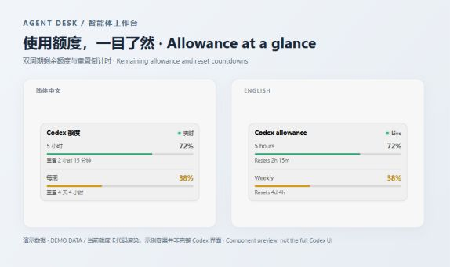

# Agent Desk · 智能体工作台

**用于任务管理、智能体协作和人工审阅的本地工作台。**

**A local workspace for agent tasks, collaboration and human review.**

[简体中文](README.zh-CN.md) · [Architecture](docs/architecture.md) · [Identity and compatibility](docs/product-identity.md) · [Publishing](docs/publishing.md)

Agent Desk brings project and task management, agent progress, handoff review,
automation preparation and usage information into the official Codex desktop app.
It is an independently maintained product derived from Dashi Taskboard, not an
OpenAI product or an official upstream release. See [NOTICE](NOTICE) for ancestry.

Agent Desk 面向 Windows 上的官方 Codex 桌面应用，提供项目与任务管理、智能体执行进展、
交接审批、自动化准备和额度信息。它是从 Dashi Taskboard 演进而来的独立维护产品，
不是 OpenAI 官方产品，也不是上游官方发行版。完整中文说明见 [README.zh-CN.md](README.zh-CN.md)。

**许可 / Licensing:** 源码可用；适用的新增部分与改动采用 Apache-2.0 + Commons Clause 1.0。
Source-available; covered additions and modifications use Apache-2.0 + Commons Clause 1.0.

## What it does

- An action-focused dashboard: reviews, blockers, deadlines and work in progress.
- Project boards, lists, Gantt views, search, labels, comments and attachments.
- Task-to-conversation navigation and project automation preparation.
- Handoff approval review through an authenticated local receiver integration.
- A compact allowance card in the native sidebar.

## Preview / 效果示例



The allowance card shows the remaining 5-hour and weekly usage percentages and reset
countdowns. This preview renders the current component with synthetic data in an
illustrative container; it is not a full Codex screenshot or installed-host acceptance.

额度卡展示 5 小时与每周使用额度及重置倒计时。上图使用演示数据，不包含真实账户信息；
它是当前组件的效果示例，不代表完整 Codex 界面或安装验收结果。

## Download / 下载

**[Download Agent Desk 1.2.0 for Windows x64 / 下载 Windows x64 安装包](https://github.com/texasisalwaysbusy/agent-desk/releases/download/v1.2.0/Agent-Desk-1.2.0-Windows-x64-setup.exe)**

[Release notes and SHA-256 / 中英文发行说明与校验文件](https://github.com/texasisalwaysbusy/agent-desk/releases/tag/v1.2.0)

Windows x64 is the supported distribution target. The installer is unsigned and
installs for the current user. Automated checks, Windows packaging and packaged-service
verification passed; installed-host, legacy-store installation and live human-approval
acceptance remain incomplete. Other platforms are not supported.

安装前请正常退出 Codex 与旧版 Taskboard 托盘程序，保留旧版安装及数据作为回退点，
不要同时运行两套启动器。安装包未签名；真实宿主安装、旧数据复用安装和人工审批执行
仍待端到端验收。

## Development

Use Node.js 24 and npm. For Windows packaging, install Rust stable 1.88 or newer,
the MSVC C++ workload and Windows SDK.

```powershell
npm ci
npm run check
npm run app:build:windows
```

`npm run dev` starts the local development frontend and service. `npm run agentdesk -- --help`
opens CLI usage. See [AGENTS.md](AGENTS.md) for validation and security rules.
Installers built here are unsigned and install for the current user. Automatic
updates are disabled. Enabling login autostart is a separate user action.

## Data and compatibility

New installations use `%LOCALAPPDATA%\AgentDesk`; existing legacy stores are reused
without an automatic move. Ambiguous stores cause an explicit error. The independent
installer does not silently replace the old application. Follow the [compatibility
notes](docs/product-identity.md) before local acceptance or migration.

The launcher uses the installed, signed Codex executable and existing login profile.
It opens no debugging TCP port and reads no authentication database. The backend
binds to loopback only. See [PRIVACY.md](PRIVACY.md).

## Source and license

**Source-available: Apache-2.0 + Commons Clause 1.0 for covered Agent Desk changes.**
You may use, study, modify and redistribute the covered software free of charge,
including internal business use. Selling the software itself or charging for a
product or service whose value derives entirely or substantially from its
functionality requires separate permission from the relevant rights holders.
This includes repackaged paid downloads and paid hosted access. It does not
ban ordinary paid work performed using the tool or independent value-added products.

Upstream Dashi Taskboard portions retain Apache-2.0; third-party components retain
their own licenses. These restrictions cannot remove their existing rights.
See [LICENSE](LICENSE), [NOTICE](NOTICE), and [licensing examples](docs/licensing.md).
Do not describe the combined project as OSI-approved open source.

Use the curated source export described in [Publishing](docs/publishing.md),
not the private working checkout or its local operational records.
