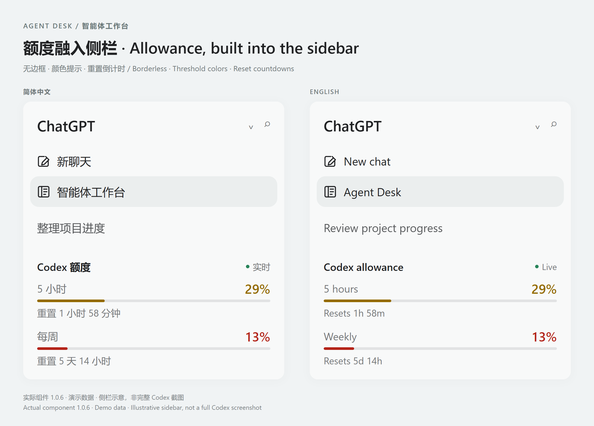

# Agent Desk · 智能体工作台

**用于任务管理、智能体协作和人工审阅的本地工作台。**

**A local workspace for agent tasks, collaboration and human review.**

[English](README.md) · [架构与边界](docs/architecture.md) · [命名与兼容](docs/product-identity.md) · [发布说明](docs/publishing.md)

Agent Desk 在官方 Codex 桌面应用内提供项目任务管理、执行进展、交接审批、
自动化准备和额度信息。它是从 Dashi Taskboard 演进而来的独立维护产品，
不是 OpenAI 官方产品，也不是上游官方发行版。来源及署名见 [NOTICE](NOTICE)。

## 核心功能

- 仪表盘直接呈现待验收、受阻、逾期和正在推进的任务，不显示问候或首页聊天窗口。
- 项目看板、列表、甘特图、搜索、标签、评论与附件。
- 任务与会话关联、项目自动化准备、侧栏额度显示。
- 通过受验证的本地接收端集成交接审批；待验收不等于执行授权。

## 效果示例



侧栏额度卡展示 **5 小时与每周的剩余使用比例、重置倒计时**，帮助判断何时继续安排任务。
这里的“额度”指使用限额，不是现金余额。示例使用实际的 1.0.6 无边框组件与演示数据
渲染，嵌入侧栏底部，并保留随剩余额度变化的颜色。
不包含真实账户信息；示例容器并非完整 Codex 界面，也不替代安装后的真实验收。

## 下载安装

**[下载 Agent Desk 1.2.2 · Windows x64 安装包](https://github.com/texasisalwaysbusy/agent-desk/releases/download/v1.2.2/Agent-Desk-1.2.2-Windows-x64-setup.exe)**

[中英文发行说明与 SHA-256 校验文件](https://github.com/texasisalwaysbusy/agent-desk/releases/tag/v1.2.2)

当前支持 Windows x64，按当前用户安装，安装包未数字签名。等价的 rc.6 实现已在
Codex 26.924.2738.0 上完成安装、启动、工作台与额度栏显示、首次正常退出和手动重开
验收。1.2.2 将该实现以稳定版本标识和 Release 编译发布。第二轮 Codex 退出码及托盘
版本文字未确认；安装文件哈希已核对。本次验收不代表人工审批执行流程已认证。
其他平台的遗留文件不代表支持承诺。

安装前请正常退出 Codex 与旧版 Taskboard 托盘程序，保留旧版安装及数据作为回退点，
不要同时运行两套启动器。

## 开发与验证

Codex 启动失败时，可从独立终端运行[实时启动诊断](docs/startup-diagnostics.md)，
供 Hermes 只读观察，不依赖工作台窗口。

使用 Node.js 24、npm；Windows 打包还需要 Rust stable 1.88+、MSVC C++ 和 Windows SDK。

```powershell
npm ci
npm run check
npm run app:build:windows
```

`npm run dev` 启动本地开发界面与服务，`npm run agentdesk -- --help` 查看命令用法。
工作约定和验证命令见 [AGENTS.md](AGENTS.md)。安装包未签名、按当前用户安装，
默认不启用登录自启动，不提供自动更新。

## 数据与旧版兼容

新安装使用 `%LOCALAPPDATA%\AgentDesk`。存在旧数据时沿用旧目录；两份目录同时
存在时停止并提示核对，不自动复制、合并或删除。新安装身份不会静默覆盖旧应用，
具体切换边界见[命名与兼容](docs/product-identity.md)。

Windows 启动器通过已注册的 Store 包启动 Codex，沿用现有登录。
每次手动启动都重新查找安装包并验证签名，注入前检查界面结构。小版本号变化不需要
更新白名单；未知结构会停止注入，不能保证所有未来版本都兼容。

这一启动路线会开放由 Codex 进程持有的随机 `127.0.0.1` 调试端口，同机其他程序
可以连接它；该端口不受工作台 API 的认证保护。不建立第二份登录资料，不读取认证
数据库，也不连接普通启动的 Codex。请先正常退出 Codex，再启动 Agent Desk。
正式安装包采用 Release 编译，保留脱敏的启动诊断和错误日志。独立开发实验不是默认
启动路线。本地保留 rc.6 方便继续诊断时，无需覆盖成 GitHub 的稳定版。

## 许可与公开发布

**源码可用：Agent Desk 有权授权的新增部分和改动采用 Apache-2.0 + Commons Clause 1.0。**
允许使用、学习、修改及免费分发，也允许公司内部使用、用此工具完成收费工作。
未经相关权利人另行授权，不允许出售软件本身、换名后收费分发，或提供价值完全或主要
来自其功能的收费托管或服务。具有实质独立价值的产品不一定受此限制，见条款定义。

上游 Dashi 代码保留 Apache-2.0；第三方组件保留各自许可证。这些部分原有的权利不受撤销。
具体范围及示例见 [LICENSE](LICENSE)、[NOTICE](NOTICE) 和[许可说明](docs/licensing.md)。
此组合许可不属于 OSI 定义的开源许可，不应宣传为无限制商用的 Apache-2.0 项目。

只使用[发布说明](docs/publishing.md)中的精选源码导出，不直接推送包含本机操作记录的工作目录。
