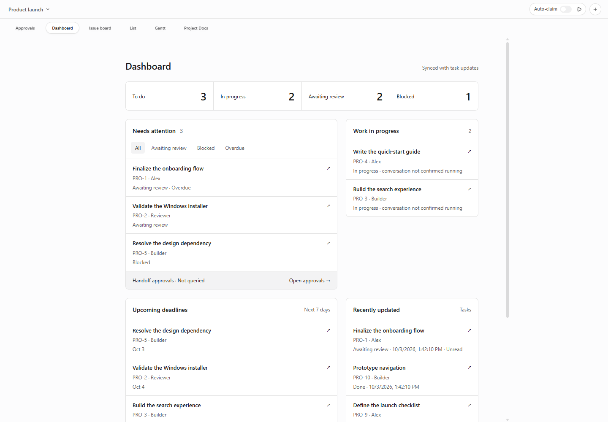
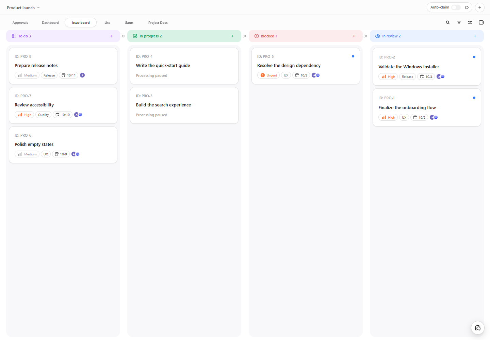
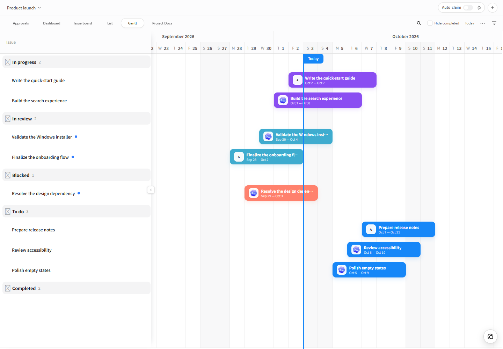

# Agent Desk · 智能体工作台

**把分散的智能体对话，组织成可追踪、可审阅、可完成的项目。**

[下载 Windows 版](https://github.com/texasisalwaysbusy/agent-desk/releases/tag/v1.2.2) · [English](README.md) · [功能例图](docs/showcase.md) · [更新日志](CHANGELOG.md)

Agent Desk 是嵌入 Windows 官方 Codex 桌面应用的本地项目工作台。任务、截止日期、智能体分工和人工审阅集中在同一个地方：知道下一步该处理什么，找到任务背后的对话，再判断结果是否可以继续推进。

如果你同时推进多个项目，或者把工作分给不同智能体，它能让“聊过什么”逐渐变成“谁在做、做到哪、还缺什么、谁来验收”。



*例图来自公开 v1.2.2 的实际网页组件，使用虚构项目和演示数据在本地渲染。不含真实账户、私人项目或运行中的智能体，也不是完整 Codex 客户端截图。*

## 从任务到结果，把工作衔接起来

| 你要解决的问题 | 工作台提供的入口 |
| --- | --- |
| 不知道先处理哪件事 | 仪表盘集中显示待验收、受阻、逾期与即将到期的任务。 |
| 多个智能体的工作难以跟踪 | 看板展示任务阶段、负责人、优先级、标签与日期。 |
| 任务多，逐张卡片浏览太慢 | 列表、搜索和筛选帮助快速定位任务。 |
| 想看任务之间的时间安排 | 甘特图把开始与截止日期放到同一条时间线上。 |
| 找不到之前的讨论和产出 | 描述、评论、附件与关联的 Codex 对话保留在任务旁。 |
| 交接操作需要人来审阅 | 配置本地接收端集成后，审批中心展示具体操作及风险。 |
| 长时间工作需要安排使用额度 | 原生侧栏显示 5 小时、每周剩余使用比例与重置倒计时。 |

### 看清任务正在走到哪一步



从等待认领、处理中，到遇到阻碍、等你确认，每个阶段都有明确的含义。智能体提交结果以后，你仍然可以保留审阅环节；任务处于“处理中”并不自动证明智能体正在运行。

### 把截止日期放进整体安排



用日期看清哪些工作重叠、哪些即将到期。偏好紧凑视图时，可以切到列表；[例图库](docs/showcase.md)展示了同一项目的不同视图。

### 让交接、审批和执行各自有据可查

审批中心在配置了本地接收端集成后，提供具体交接内容的人工审阅入口。收到申请、认领任务、提交验收和允许执行是不同的步骤。审批决定不会自动启动智能体，也不会授予无限制的命令权限。

项目自动化为 Codex 原生定时任务准备请求，不另外安装后台调度器。任务 CLI 与本地 MCP 插件为智能体提供访问项目工作的入口。

## 一个实用的开始方式

1. 安装 Agent Desk，正常退出普通启动的 Codex，再从 Agent Desk 托盘启动。
2. 打开工作台，选择项目，创建有明确结果、负责人和截止日期的任务。
3. 关联相关对话，用看板或列表跟踪任务推进。
4. 审阅产出、解决阻碍，将验收后的任务标为完成，再回仪表盘决定下一步。

## 下载、版本与兼容

**[下载 Agent Desk 1.2.2 · Windows x64 安装包](https://github.com/texasisalwaysbusy/agent-desk/releases/download/v1.2.2/Agent-Desk-1.2.2-Windows-x64-setup.exe)**

[发行说明与 SHA-256 校验文件](https://github.com/texasisalwaysbusy/agent-desk/releases/tag/v1.2.2) · [已知问题与候选状态](docs/known-issues.md)

目前公开稳定版是 v1.2.2；1.2.3 正在进行 CI 验证，尚未发布。按当前用户安装，安装包未签名。支持 Windows x64，不提供自动更新；登录自启动由你选择启用。

1.2.3 的运行实现已在 Codex 26.930.3930.0 完成两轮现场验收：已有对话直接打开工作台、定时任务/设置返回、侧栏布局、额度恢复及正常退出均通过；约20分钟静置表现稳定，用户确认接受该结果。准备中的 1.2.3 更新包含维护修补和已选定的玻璃额度样式。[发行说明](docs/release-1.2.3.md)记录验收范围。

安装或启动前正常退出 Codex 和旧托盘，保留旧版安装及数据作为回退点，不同时运行两套启动器。每个新文档都要通过结构兼容检查，不能保证所有未来 Codex 版本都兼容。人工审批执行需要另行配置集成并验收。

## 数据留在本地，边界保持清楚

新安装将应用数据保存在 `%LOCALAPPDATA%\AgentDesk`。存在旧数据时沿用旧目录，不自动搬移；目录歧义会提示核对，不自动合并或删除。详见[命名与兼容](docs/product-identity.md)及[隐私说明](PRIVACY.md)。

启动器使用已注册的官方 Store 包与现有登录，验证身份及签名，并开放由 Codex 进程持有的随机 `127.0.0.1` 调试端口。同机其他程序可以访问该端口，它不受工作台 API 的认证保护。不修改官方安装包，不读取认证数据库，不附加普通启动的 Codex；正常退出 Codex 才会关闭其调试端口。

## 开发与反馈

使用 Node.js 24、npm；Windows 打包需要 Rust stable 1.88+、MSVC C++ 与 Windows SDK。

```powershell
npm ci
npm run check
npm run app:build:windows
```

`npm run dev` 启动本地开发预览，`npm run agentdesk -- --help` 查看 CLI。工作约定见 [AGENTS.md](AGENTS.md)，技术边界见[架构](docs/architecture.md)，启动失败可参考[诊断说明](docs/startup-diagnostics.md)。反馈问题时请提供版本、复现步骤、预期/实际行为与脱敏诊断，不上传凭据或私人对话。

## 来源与许可

Agent Desk 从 Dashi Taskboard 演进而来，是独立维护的产品，不是 OpenAI 官方产品或上游官方发行版。

**源码可用：有权授权的 Agent Desk 新增部分与改动采用 Apache-2.0 + Commons Clause 1.0。** 上游 Dashi 代码保留 Apache-2.0，第三方组件保留各自许可。

允许使用、学习、修改及免费分发，也允许公司内部使用、用工具完成收费工作。出售软件本身或提供价值完全或主要来自其功能的收费产品/服务，需要相关权利人另行授权。这一组合许可不属于 OSI 定义的开源许可。

[LICENSE](LICENSE) · [NOTICE](NOTICE) · [许可示例](docs/licensing.md) · [精选源码发布](docs/publishing.md)
