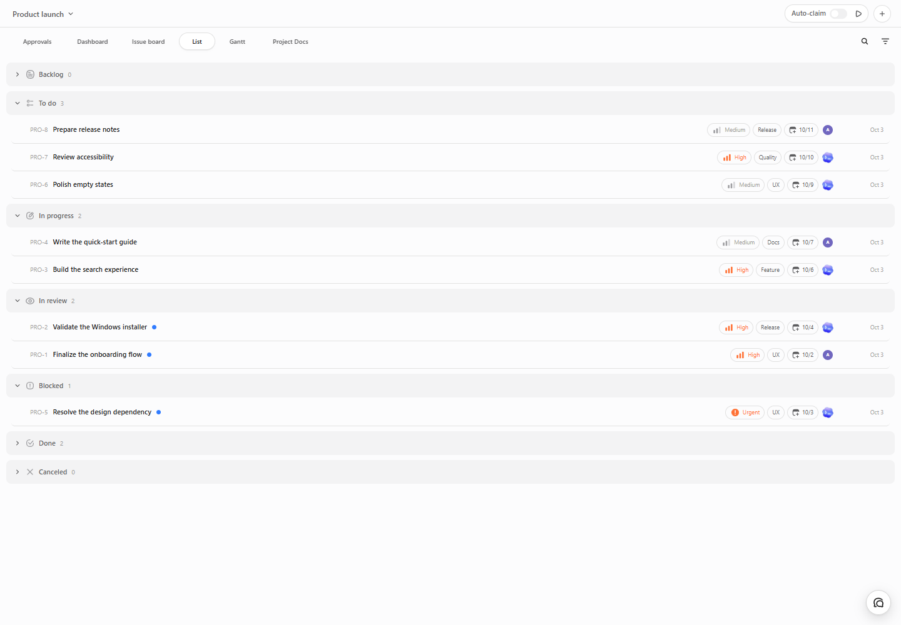

# A project, four views / 一个项目，四种视图

These screenshots render the actual public v1.2.2 web application from source commit `88cd689333cd9b62c34fbb31a7592a237a3ce66c`. The fictional “Product launch” project contains ten tasks, one demo person and two demo agents. No real account, workspace, conversation or agent execution is used. The local web preview is not the full Codex host and does not certify installation, approval execution or runtime compatibility.

例图来自公开 v1.2.2 的实际组件。虚构的“Product launch”项目包含10个任务、1位演示用户和2个演示智能体，不读取真实账户、工作目录或对话，不运行智能体。独立网页预览不是完整 Codex 宿主，也不替代安装/审批执行/兼容验收。

## Dashboard / 仪表盘

Find reviews, blockers and dates before opening individual tasks. Running status is kept distinct from a task's “In progress” label.

先看待验收、阻碍与日期，再进入具体任务；进行中的任务不自动等于正在运行的智能体。

## Board / 看板

Follow task stages, assignments, priorities and labels. The visible cards belong to the same project as the dashboard.

看清同一项目的任务阶段、负责人、优先级与标签。

## List / 列表

Scan work by status in a compact layout, with owners and due dates beside each issue.

按状态快速浏览，将负责人和截止日期放在任务旁。

## Gantt / 甘特图

See start/due dates on a timeline and compare overlapping work.

将开始/截止日期放在时间线上，比较任务的时间重叠。

[Back to the introduction](../README.md) · [返回中文介绍](../README.zh-CN.md)
